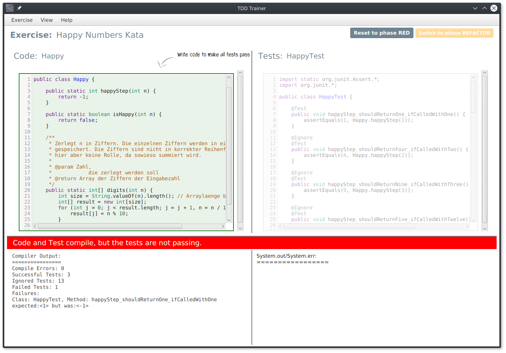

# Test Driven Development Trainer

Define your exercises for your students to train and learn test-driven development. This trainer forces the students
through the typical phases in TDD, i.e. Write failing test --> Pass the test --> Refactor --> Write failing test --> ...

## Usage
* Type 'gradle distZip' to build the distribution
* Type 'gradle run' to run the application directly

### Use your own katalog

You can specify your own katalog by calling the binary with this command:

    DOJO_OPTS="-Dkatalog=path/to/katalog.json" ./bin/dojo

## Contributions

This tool is based on a students' project by Marcel Käufler, Antonia Pütz, Benedikt Schmeitz, Luisa Schuhmacher & Simon Weber
